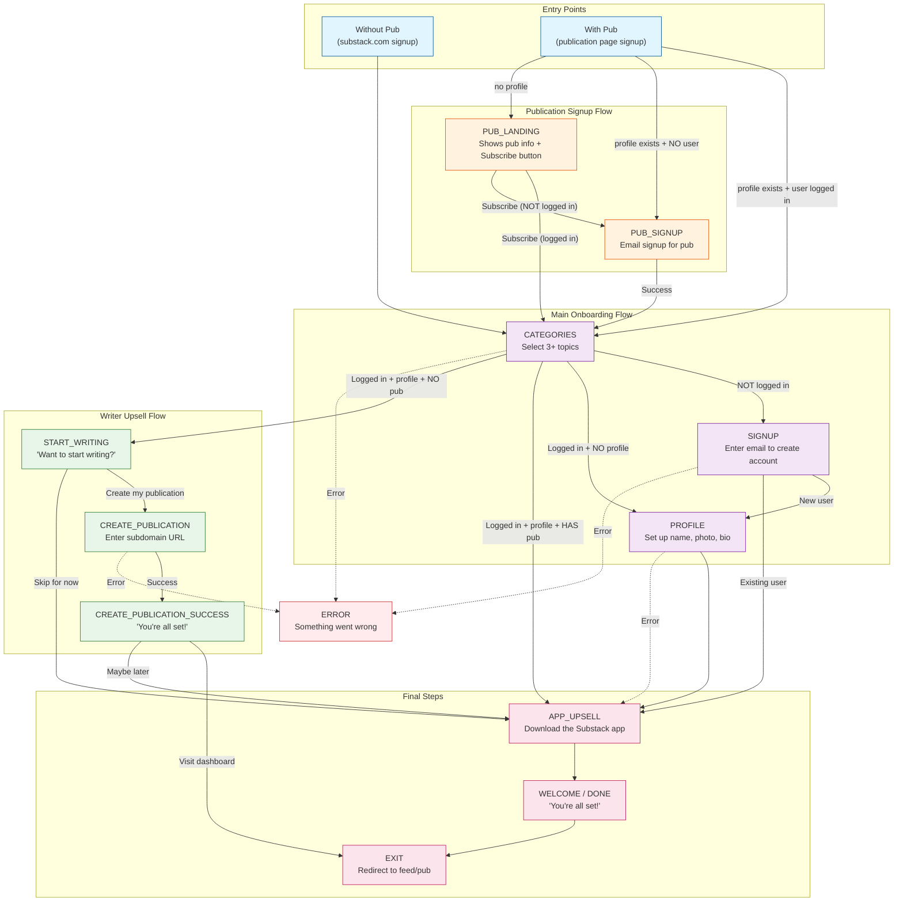

```mermaid
flowchart TD
    subgraph Entry["Entry Points"]
        E1["Without Pub<br/>(substack.com signup)"]
        E2["With Pub<br/>(publication page signup)"]
    end

    subgraph PubFlow["Publication Signup Flow"]
        PUB_LANDING["PUB_LANDING<br/>Shows pub info + Subscribe button"]
        PUB_SIGNUP["PUB_SIGNUP<br/>Email signup for pub"]
    end

    subgraph MainFlow["Main Onboarding Flow"]
        CATEGORIES["CATEGORIES<br/>Select 3+ topics"]
        SIGNUP["SIGNUP<br/>Enter email to create account"]
        PROFILE["PROFILE<br/>Set up name, photo, bio"]
    end

    subgraph WriterFlow["Writer Upsell Flow"]
        START_WRITING["START_WRITING<br/>'Want to start writing?'"]
        CREATE_PUBLICATION["CREATE_PUBLICATION<br/>Enter subdomain URL"]
        CREATE_PUBLICATION_SUCCESS["CREATE_PUBLICATION_SUCCESS<br/>'You're all set!'"]
    end

    subgraph FinalFlow["Final Steps"]
        APP_UPSELL["APP_UPSELL<br/>Download the Substack app"]
        WELCOME["WELCOME / DONE<br/>'You're all set!'"]
        EXIT["EXIT<br/>Redirect to feed/pub"]
    end

    ERROR["ERROR<br/>Something went wrong"]

    %% Entry Points
    E1 --> CATEGORIES
    E2 -->|"profile exists + user logged in"| CATEGORIES
    E2 -->|"profile exists + NO user"| PUB_SIGNUP
    E2 -->|"no profile"| PUB_LANDING

    %% Pub Flow
    PUB_LANDING -->|"Subscribe (logged in)"| CATEGORIES
    PUB_LANDING -->|"Subscribe (NOT logged in)"| PUB_SIGNUP
    PUB_SIGNUP -->|"Success"| CATEGORIES

    %% Categories branching logic
    CATEGORIES -->|"NOT logged in"| SIGNUP
    CATEGORIES -->|"Logged in + NO profile"| PROFILE
    CATEGORIES -->|"Logged in + profile + HAS pub"| APP_UPSELL
    CATEGORIES -->|"Logged in + profile + NO pub"| START_WRITING

    %% Signup flow
    SIGNUP -->|"New user"| PROFILE
    SIGNUP -->|"Existing user"| APP_UPSELL

    %% Profile flow
    PROFILE --> APP_UPSELL

    %% Writer upsell flow
    START_WRITING -->|"Create my publication"| CREATE_PUBLICATION
    START_WRITING -->|"Skip for now"| APP_UPSELL
    CREATE_PUBLICATION -->|"Success"| CREATE_PUBLICATION_SUCCESS
    CREATE_PUBLICATION_SUCCESS -->|"Visit dashboard"| EXIT
    CREATE_PUBLICATION_SUCCESS -->|"Maybe later"| APP_UPSELL

    %% Final steps
    APP_UPSELL --> WELCOME
    WELCOME --> EXIT

    %% Error handling
    CATEGORIES -.->|"Error"| ERROR
    SIGNUP -.->|"Error"| ERROR
    PROFILE -.->|"Error"| APP_UPSELL
    CREATE_PUBLICATION -.->|"Error"| ERROR

    %% Styling
    classDef entry fill:#e1f5fe,stroke:#01579b
    classDef pub fill:#fff3e0,stroke:#e65100
    classDef main fill:#f3e5f5,stroke:#7b1fa2
    classDef writer fill:#e8f5e9,stroke:#2e7d32
    classDef final fill:#fce4ec,stroke:#c2185b
    classDef error fill:#ffebee,stroke:#c62828

    class E1,E2 entry
    class PUB_LANDING,PUB_SIGNUP pub
    class CATEGORIES,SIGNUP,PROFILE main
    class START_WRITING,CREATE_PUBLICATION,CREATE_PUBLICATION_SUCCESS writer
    class APP_UPSELL,WELCOME,EXIT final
    class ERROR error
```
